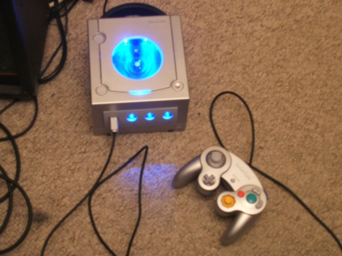

### Sprint 2005

I first got into electronics when the console modding scene kicked off back in 2004, and whilst most of my electronics projects back then were for aesthetic pleasure, I did eventually get into software modding too thanks to the xbox evolution OS, and eventualy got into functional hardware modifications too.

### Metku Mods

A brilliant and active website which was the breeding grounds for what is still a popular movement existed, [Metku.net](http://metku.net/) was as far as I'm concerned the home of all things mod, and not just cosmetic. They created a brilliant set of tutorials that most of what was needed for understanding how to modify an electronic circuit, down to lapping your CPU heatsink to a mirror finish for a more efficient heat transfer.

They had a [Mod Gallery](http://metku.net/modgallery/) which was the first section that allowed users to exhibit their projects, it later got succeeded by [AllTheMods](http://allthemods.com/), though unfortunetly both are very much dead. It's quite sad for me to go back to these sites as it was once a decade ago such a vibrant community of helpful and kind individuals.

### My Submissions

I did of course submit a few of my own projects around 2005 when i was 15, one of which made the 'Hall of Fame' which i was very pleased about, as it meant my project was showcased on the homepage. 

Of course in the coming years I'd cease almost all cosmetic modifications as my knowledge matured, such did my desire to achieve more functional hacks. Nevertheless [here is my gamecube](./gamecube/) which consisted only of cosmetic mods, and [here is my xbox](./xbox/) (after killing the other one), which consisted of many functional hacks and mods. 

*I've mirrored the two previous sites should they go down in the future, but for historical purposes [here](http://metku.net/modgallery/detail.php?id=3645) and [here](http://metku.net/modgallery/detail.php?id=4016) are the projects respectively on their original sites*

You can read and laugh at my horrendous descriptions, it is rather cringe-worthy when you read most of what you wrote probably anywhere when you were a youngster. 

### Gamecube

Possibly my most attractive cosmetic hack, this made it to the 'Hall of Fame' and was on the homepage of the very popular Mod Gallery for some time. The sad thing about this small clique of a niche community is that many of the people I'd like to give credit to are now 404, although i remember the few that inspired me the most other than [Jani 'Japala' Pönkkö](http://metku.net/index.html?sect=contacts) of Metku Mods is Duey2K (site 404'd many years ago) who gave me the inspiration to get creative with light source placement (primarily the light emission from the controller ports below), and ben999 (I *honestly* can't remember if this was his alias - internet people don't seem to do real names especially back in 2005!).  

An LED extravaganza, including two LEDs on the inside of each controller port! In the gamecube's controller ports you have four metal spring-like locks every 90 degrees to hold the controller in, but release if you yank too hard. You can get away with two, so I removed the top and bottom and placed a diffused LED on both sides. These were wired in parallel. The top jewel was cut out with a remaining lip for it to stand, it was made clear using the lapping technique discussed below, and has four LEDs wired in series emitting from the back. 

I was quite chuffed with myself and saw myself as an excellent business man as I went on to sell this unit for three or four times the cost of the original parts. I had an idea to sell modifications on eBay, and did make some money back then buying and selling odd parts, but the introduction to VAT fee's killed my profit and my dodgy salesman days were over.

### Xbox

This was my first system wide hack that involved more software and hardware modifications to actually improve the hardware. It was also my first and last project that involved spray paint, the number of layers required for a decent finish didn't bode well with my level of patience. 

The console was chipped by yours truly, unlike the very first xbox i owned which I went on to kill during cosmetic modification attempts shown below (RIP). The chip allowed for the installation of a linux based OS that provided a heap of additional functionality. Taking the Jewel off the xbox required hot air to heat the adhesive, then i essentially ['lapped'](http://metku.net/index.html?path=mods/lapping/index_eng) the plastic, using low grit sandpaper to high grit (300 to 2000), then down to wet paper with toothpaste on it (!) to create a totally transparent (sometimes mirror) finish, if you were patient enough. I had my [art friend](http://bjum.uk/) to draw a dragon on the inside with enamel paint; added a bunch of LEDs, and changed the fans and HDD. 

Of course I had close to no idea what i was *really* doing when performing these mods, and the majority of them were done whilst following online notes and tutorials. Having said that, they were essentially the gateway drug for what i'd go on to do in 5 years time, which was to start a degree in Computer Engineering, the amalgamation of a Computer Science and electronics engineering degree, designed to create panic attacks and nervous breakdowns. 